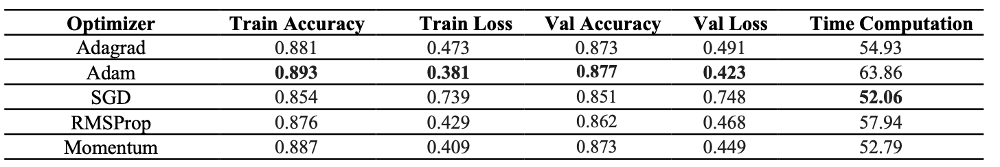

# optimizers-and-regularizations-techniques
This project implements and compares different optimization and regularization methods for an MLP neural network on the Fashion MNIST dataset. It includes implementing five optimization methods and two regularization methods and determining the best architecture for the MLP. The test accuracy of the best model is reported.

# Dataset
The dataset used in this project is the Fashion MNIST dataset, which consists of 70,000 grayscale images of 28x28 pixels each, representing 10 categories of clothing items. The dataset is available on GitHub at https://github.com/zalandoresearch/fashion-mnist. ↗
The dataset is divided into three parts: train, validation, and test. The validation set is used to compare the performance of different models.

# Result

